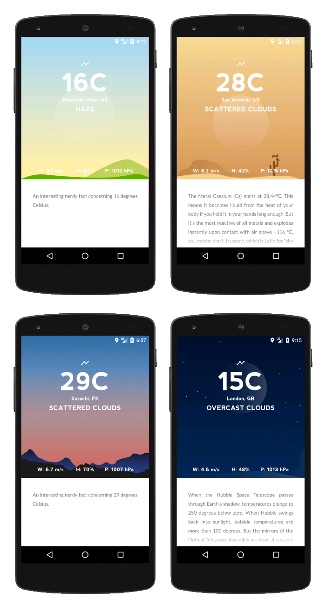

# Nerd Weather

A weather app for Android that shows interesting facts related to the day's temperature.

This app was a group project for the "Introduction to Media Computer Science" ([EMI][1]) course at TU Dresden.

Group members: Adnan, Ibrahim, Jana, Jonas, and Talal.

## Screenshots



## Usage

minSdkVersion: 24 (Android 7.0)

1. Get a "current weather data" API key from [OpenWeatherMap](https://openweathermap.org/API).
2. Open the `WeatherAPI.java` file and put your API key as the value for the `API_KEY` variable (line 21). It should look like this:

	```java
	private static final String API_KEY = "your-openweathermap-api-key";
	```

4. That's it. You can either:
	- run the app in Android Studio in a virtual device. You will need to send
		the longitude and lattitude coordinates manually through the virtual
		device's extended controls window.
	- build an apk file for the app and install it on an Android device. The app
		will get the location coordinates automatically through the device's GPS
		sensor.

[1]: https://tu-dresden.de/ing/informatik/ai/mci/studium/lehrveranstaltungen-1/einfuehrung-in-die-medieninformatik?set_language=en
